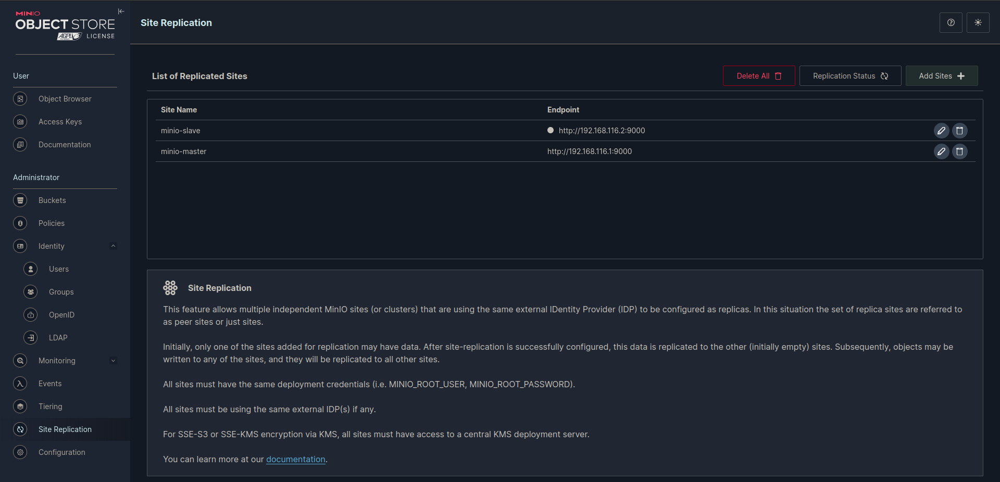

# Minio Active Active Quickstart Guide
[](https://min.io)
MinIO is a High Performance Object Storage released under GNU Affero General Public License v3.0. It is API compatible with Amazon S3 cloud storage service. Use MinIO to build high performance infrastructure for machine learning, analytics and application data workloads.

This README provides quickstart instructions on running MinIO on two node container-based installations.

## Container Installation
#### files structures :
```
--- docker.compose.yml
--- .env
```
### docker-compose.yml
```sh
version: '3.7'

services:
  minio:
    image: minio/minio:RELEASE.2024-07-16T23-46-41Z
    restart: unless-stopped
    command: server --console-address ":9001" /data
    environment:
      - MINIO_ROOT_USER=${MINIO_ROOT_USER}
      - MINIO_ROOT_PASSWORD=${MINIO_ROOT_PASSWORD}
    expose:
      - "9000"
      - "9001"
    hostname: minio_master
    volumes:
      - ./data:/data
      - /etc/localtime:/etc/localtime:ro
    ports:
      - 9000:9000
      - 9001:9001
    healthcheck:
      test: ["CMD", "curl", "-f", "http://localhost:9000/minio/health/live"]
      interval: 30s
      timeout: 20s
      retries: 3

```
### .env
```sh
MINIO_ROOT_USER=<user>
MINIO_ROOT_PASSWORD=<password>
```

after instalation you need to open this url: `minio-ip:9001` and set replication on theleft menu as you see in the bottom image:



### replication :
you only need to add one replica and system add another replica automaticaly.

### replication on old versions :
for some version of minio, if you havn't the replication on menu you need to add with mc command like this:
```sh
mc replicate add <minio-server>
```

finally you need yo config nginx behind of nginx server you need to use  this config:

## nginx config
```bash
pstream minio_s3 {
   least_conn;
   server 192.168.1.1:9000;
   server 192.168.1.2:9000;

}

upstream minio_console {
   least_conn;
   server 192.168.1.1:9001;

}

server {
   listen       80;
   listen  [::]:80;
   server_name  minio.local.com;

   # Allow special characters in headers
   ignore_invalid_headers off;
   # Allow any size file to be uploaded.
   # Set to a value such as 1000m; to restrict file size to a specific value
   client_max_body_size 0;
   # Disable buffering
   proxy_buffering off;
   proxy_request_buffering off;

   location / {
      proxy_set_header Host $http_host;
      proxy_set_header X-Real-IP $remote_addr;
      proxy_set_header X-Forwarded-For $proxy_add_x_forwarded_for;
      proxy_set_header X-Forwarded-Proto $scheme;

      proxy_connect_timeout 300;
      # Default is HTTP/1, keepalive is only enabled in HTTP/1.1
      proxy_http_version 1.1;
      proxy_set_header Connection "";
      chunked_transfer_encoding off;

      proxy_pass http://minio_s3; # This uses the upstream directive definition to load balance
   }
}

server {

   listen       80;
   listen  [::]:80;
   server_name  console.local.com;

   # Allow special characters in headers
   ignore_invalid_headers off;
   # Allow any size file to be uploaded.
   # Set to a value such as 1000m; to restrict file size to a specific value
   client_max_body_size 0;
   # Disable buffering
   proxy_buffering off;
   proxy_request_buffering off;

   location / {
      proxy_set_header Host $http_host;
      proxy_set_header X-Real-IP $remote_addr;
      proxy_set_header X-Forwarded-For $proxy_add_x_forwarded_for;
      proxy_set_header X-Forwarded-Proto $scheme;
      proxy_set_header X-NginX-Proxy true;

      # This is necessary to pass the correct IP to be hashed
      real_ip_header X-Real-IP;

      proxy_connect_timeout 300;

      # To support websocket
      proxy_http_version 1.1;
      proxy_set_header Upgrade $http_upgrade;
      proxy_set_header Connection "upgrade";

      chunked_transfer_encoding off;

      proxy_pass http://minio_console/; # This uses the upstream directive definition to load balance
   }
}

```

## Test
### mc
```sh
mc alias set minio-master <user> <password>
mc alias ls
mc ls minio-master/<bucket-name>
```

### python
python script for connect to MinIO adn generate 100 file and upload to minio service :
```python
import os
from faker import Faker
from minio import Minio
from minio.error import S3Error

# Configuration
MINIO_ENDPOINT = "min.local.com"  # Change to your MinIO server endpoint
ACCESS_KEY = "<user>"          # Replace with your MinIO access key
SECRET_KEY = "<password>"      # Replace with your MinIO secret key
BUCKET_NAME = "<bucket-name>"  # Replace with your MinIO bucket name
NUM_FILES = 100                # Number of fake files to generate

# Initialize Faker and MinIO client
fake = Faker()
minio_client = Minio(MINIO_ENDPOINT,
                      access_key=ACCESS_KEY,
                      secret_key=SECRET_KEY,
                      secure=False)  # Set to True if using HTTPS

# Create bucket if it doesn't exist
try:
    if not minio_client.bucket_exists(BUCKET_NAME):
        minio_client.make_bucket(BUCKET_NAME)
except S3Error as e:
    print(f"Error creating bucket: {e}")

# Generate fake files and upload to MinIO
for i in range(NUM_FILES):
    # Generate fake content
    file_name = f"fake_file_{i + 1}.txt"
    content = fake.text(max_nb_chars=200)  # Generate random text content

    # Save the content to a local file
    with open(file_name, 'w') as f:
        f.write(content)

    # Upload the file to MinIO
    try:
        minio_client.fput_object(BUCKET_NAME, file_name, file_name)
        print(f"Uploaded {file_name} to bucket {BUCKET_NAME}")
    except S3Error as e:
        print(f"Error uploading {file_name}: {e}")

    # Optionally, remove the local file after uploading
    os.remove(file_name)

print("All files uploaded successfully.")
```

## Monitoring
for monitoring you need to generate some access key to prometheus can connect to minio server and get data you can watch this guide :

## List of metrics exposed by MinIO

- MinIO exports Prometheus compatible data by default as an authorized endpoint at `/minio/v2/metrics/cluster`. 
- MinIO exports Prometheus compatible data by default which is bucket centric as an authorized endpoint at `/minio/v2/metrics/bucket`.
- MinIO exports Prometheus compatible data by default which is node centric as an authorized endpoint at `/minio/v2/metrics/node`.
- MinIO exports Prometheus compatible data by default which is resource centric as an authorized endpoint at `/minio/v2/metrics/resource`.

All of these can be accessed via Prometheus dashboard. A sample list of exposed metrics along with their definition is available on our public demo server at

```sh
curl https://play.min.io/minio/v2/metrics/cluster
```

for generate access token you need to run this mc command :
```sh
mc admin prometheus generate minio cluster
mc admin prometheus generate minio bucket
mc admin prometheus generate minio node
mc admin prometheus generate minio resource
```

### prometheus config:
```sh
  - job_name: minio-job
    bearer_token: <token>
    metrics_path: /minio/v2/metrics/cluster
    scheme: http
    static_configs:
      - targets: ['192.168.1.1:9000','192.168.1.2:9000']

  - job_name: minio-job-node
    bearer_token: <token>
    metrics_path: /minio/v2/metrics/node
    scheme: http
    static_configs:
      - targets: ['192.168.1.1:9000','192.168.1.2:9000']

  - job_name: minio-job-bucket
    bearer_token: <token>
    metrics_path: /minio/v2/metrics/bucket
    scheme: http
    static_configs:
      - targets: ['192.168.1.1:9000','192.168.1.2:9000']

  - job_name: minio-job-resource
    bearer_token: <token>
    metrics_path: /minio/v2/metrics/resource
    scheme: http
    static_configs:
      - targets: ['192.168.1.1:9000','192.168.1.2:9000']

```
### dashboards :

## Prerequisites

- Prometheus and MinIO configured as explained in [document here](https://github.com/minio/minio/blob/master/docs/metrics/prometheus/README.md).
- Grafana installed as explained [here](https://grafana.com/grafana/download).

## MinIO Grafana Dashboard

Visualize MinIO metrics with our official Grafana dashboard available on the [Grafana dashboard portal](https://grafana.com/grafana/dashboards/13502).

Refer to the dashboard [json file here](https://raw.githubusercontent.com/minio/minio/master/docs/metrics/prometheus/grafana/minio-dashboard.json).


Node level Replication metrics can be viewed in the Grafana dashboard using [json file here](https://raw.githubusercontent.com/minio/minio/master/docs/metrics/prometheus/grafana/replication/minio-replication-node.json)


CLuster level Replication metrics can be viewed in the Grafana dashboard using [json file here](https://raw.githubusercontent.com/minio/minio/master/docs/metrics/prometheus/grafana/replication/minio-replication-cluster.json)


Bucket metrics can be viewed in the Grafana dashboard using [json file here](https://raw.githubusercontent.com/minio/minio/master/docs/metrics/prometheus/grafana/bubcket/minio-bucket.json)


Node metrics can be viewed in the Grafana dashboard using [json file here](https://raw.githubusercontent.com/minio/minio/master/docs/metrics/prometheus/grafana/node/minio-node.json)


Note: All these dashboards are provided as an example and need basis they should be customized as well as new graphs should be added.

### some of refrences:

https://github.com/minio/minio  
https://github.com/minio/minio/blob/master/docs/metrics/prometheus/README.md
https://github.com/minio/minio/blob/master/docs/metrics/prometheus/grafana/README.md

done.